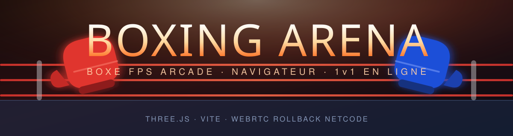

<div align="center">



### 🥊 Jeu de boxe arcade en vue subjective, 100 % dans le navigateur

**[▶️ JOUER MAINTENANT](https://ikono85.github.io/boxe/)**

[](https://ikono85.github.io/boxe/)
[](https://github.com/ikono85/boxe/actions)
[](https://threejs.org)
[](https://vitejs.dev)
[](#-en-ligne-1-contre-1)

*Pas d'installation. Pas de téléchargement d'assets. Ouvrez, verrouillez la souris, et frappez.*

</div>

---

## 📸 Aperçu

Le plus simple reste d'**[essayer directement](https://ikono85.github.io/boxe/)** — le jeu
se charge en quelques secondes, sans installation.

<details>
<summary><b>📷 Ajouter des captures et un GIF ici</b></summary>

<br>

Déposez vos fichiers dans `docs/`, puis décommentez le bloc correspondant ci-dessous dans
le README.

| Fichier attendu | Contenu suggéré |
| --- | --- |
| `docs/gameplay.gif` | 5–10 s d'échange : jab, esquive latérale, contre au corps |
| `docs/shot-combat.png` | Vue de combat avec le HUD |
| `docs/shot-dodge.png` | Une esquive latérale au moment de l'impact |
| `docs/shot-ko.png` | L'écran de KO / la décision des juges |

Pour capturer : `npm run dev`, puis **ShareX** (Windows), **Peek** (Linux) ou
**⌘⇧5 + Gifski** (macOS). Visez 800–1000 px de large et moins de 5 Mo par GIF.

```html
<!-- Une fois les fichiers en place, retirez les balises de commentaire :

<div align="center">
  
</div>

| Combat | Esquive & contre | KO |
| :---: | :---: | :---: |
|  |  |  |

-->
```

</details>

---

## 🚀 Démarrage

```bash
npm install
npm run dev     # http://localhost:5173
```

> Node **20.19+** ou **22.12+** (requis par Vite 8).

<details>
<summary><b>Tous les scripts npm</b></summary>

| Commande | Rôle |
| --- | --- |
| `npm run dev` | Serveur de développement |
| `npm run build` | Build de production dans `dist/` |
| `npm run preview` | Sert `dist/` |
| `npm run build:standalone` | `dist-standalone/boxing-arena.html` — **un seul fichier**, s'ouvre par double-clic |
| `npm run simulate` | Banc d'essai sans rendu : esquives + combats IA simulés |
| `npm test` | Netcode : déterminisme, sauvegarde/restauration, rollback |
| `npm run optimize:ring <dossier>` | Prépare un modèle de ring glTF pour le jeu |

</details>

Déploiement automatique sur GitHub Pages à chaque push sur `main`
(`.github/workflows/deploy.yml`). `?debug` dans l'URL expose le jeu dans la console
(`window.__boxing`).

---

## 🎮 Commandes

| Touche | Action |
| --- | --- |
| `Z Q S D` (ou `WASD`, flèches) | Se déplacer |
| 🖱️ Souris | Regarder et viser (tête ou corps) |
| 🖱️ Clic gauche | **Jab** (gauche) |
| 🖱️ Clic droit | **Direct** (droit) |
| `E` / `R` (ou boutons latéraux souris) | **Crochet** gauche / droit |
| `F` / `G` | **Uppercut** gauche / droit |
| `Espace` (maintenir) | **Garde** — en regardant vers le bas : garde basse (protège le corps) |
| `Maj` + direction | **Esquive** : côté (`Q`/`D`), recul (`S`), tête baissée (seule ou `Z`) |
| `C` | Baisser la tête |
| `Échap` / `P` | Pause |
| `H` | Afficher / masquer l'aide |
| `Entrée` | Passer la minute de repos |

Les touches sont déclarées **par position physique** (`KeyboardEvent.code`) dans
`src/config/Controls.js` : ZQSD et WASD fonctionnent quel que soit le clavier.

---

## 🥊 Ce qui se passe sur le ring

<table>
<tr><td width="50%" valign="top">

**⚡ Coups en quatre temps**
Anticipation → frappe → impact (gel d'image) → retour en garde. Chaque main a sa propre
animation : pendant que le jab revient, le direct part.

**📐 Trajectoires réelles**
Jab et direct en ligne droite, crochet en arc latéral qui traverse la cible, uppercut qui
monte sous le menton. Les gants affichés suivent **exactement** la trajectoire utilisée
pour détecter l'impact.

**🎯 Tête ou corps**
La visée décide. Les coups au corps font moins de dégâts mais vident l'endurance adverse
et ralentissent sa récupération ; la garde haute ne les arrête pas.

**🤸 Esquives géométriques**
L'esquive déplace vraiment la tête.
· Latérale → évite directs et uppercuts, **pas** les crochets.
· Tête baissée → évite directs et crochets, mais un uppercut dans la tête baissée est un
critique assuré.
· Recul → met hors de portée.
Les coups au corps ne s'esquivent pas avec la tête.

</td><td width="50%" valign="top">

**🛡️ Garde**
Réduit fortement les coups à la tête (85 %), un peu moins contre l'uppercut, rien quand on
est attaqué de côté. Bloquer coûte de l'endurance ; bloquer à sec brise la garde.

**💨 Endurance**
Chaque coup coûte, rater coûte plus. Essoufflé, on frappe moins fort, moins vite, on se
déplace moins vite. On récupère au repos, moins en se déplaçant, encore moins en garde.

**↩️ Contres**
Toucher pendant son coup (*contre*), juste après son coup raté (*punition*) ou juste après
avoir esquivé / bloqué (*riposte*) = bonus de dégâts et de chances de critique.

**💥 Critiques, étourdissement, KO**
Les coups propres à la tête remplissent une jauge ; pleine, le boxeur est sonné (garde
baissée, titube). 0 HP = KO.

**🔗 Combos** *(fenêtre courte, anticipation raccourcie)*
Jab → Direct · Jab → Jab → Direct · Jab → Crochet → Uppercut · Jab → Direct → Crochet ·
Direct → Crochet · Uppercut → Crochet · Double crochet.

**⏱️ Rounds**
1, 3 ou 5 rounds de 60, 90 ou 120 s, minute de repos avec récupération partielle et conseil
du coin. Sans KO, trois juges notent chaque round (système des 10 points) : décision
unanime, partagée, majoritaire ou match nul.

</td></tr>
</table>

---

## 🌐 En ligne (1 contre 1)

Menu **En ligne**, chacun sur son écran.

| Mode | Comment |
| --- | --- |
| 🎲 **Partie rapide** | Adversaire au hasard, 3 rounds de 60 s. Six emplacements fixes où un joueur attend qu'un autre le rejoigne. |
| 🔐 **Duel privé** | Vous recevez un code de 5 lettres (et un lien `#duel=CODE`) à envoyer à votre ami. Format : celui de l'hôte. |
| 🔗 **Rejoindre** | Tapez le code de votre ami, ou ouvrez simplement son lien. |

Chaque joueur choisit son nom et son boxeur (short rouge, t-shirt, gilet orange). Revanche
à la fin du combat ; quitter pendant un combat donne la victoire par forfait à l'autre.

> **Pas de serveur de jeu.** Les deux navigateurs se connectent directement (WebRTC). Le
> serveur public gratuit de PeerJS sert uniquement à se trouver (le code du duel est un
> identifiant PeerJS) ; il est libéré dès que le combat commence.

<details>
<summary><b>🔬 Netcode à rollback (<code>src/net/</code>) — comment ça marche</b></summary>

- La simulation du combat est **déterministe** et avance par pas fixes de 1/60 s
  (`OnlineWorld.js`) ; on n'échange que les **commandes** (`Command.js` : déplacement,
  garde, esquives, coups et direction du regard — 3 entiers par tick), appliquées 2 ticks
  plus tard.
- La commande adverse qui n'est pas encore arrivée est **prédite** (il continue ce qu'il
  faisait) ; quand elle arrive et diffère, on revient à l'état sauvegardé (`SimState.js`)
  et on **resimule** jusqu'à maintenant.
- L'hôte envoie son état toutes les 0,5 s : si un calcul flottant diffère d'un navigateur à
  l'autre, l'invité se recale ; la fin du match est décidée par l'hôte.
- Votre caméra suit votre souris **tout de suite** (la simulation reçoit votre regard 2 ticks
  plus tard) ; pas de gel d'image ni de ralenti en ligne.
- Pas de pause en ligne : `Échap` propose d'abandonner. Ping affiché dans le HUD.

**Limites** — certains réseaux (école, entreprise) bloquent les connexions directes ; PeerJS
fournit un relais gratuit, sans garantie. Au-delà d'environ 150 ms de ping, les corrections
deviennent visibles. Le jeu en ligne ne fonctionne pas dans une page intégrée sans WebRTC :
utilisez la version GitHub Pages.

`npm test` vérifie que deux simulations restent identiques, que la sauvegarde/restauration
est exacte et qu'un rollback retombe sur le même combat.

</details>

---

## 🤖 L'adversaire

| Niveau | Boxeur | Comportement |
| :--- | :--- | :--- |
| 🟢 **Débutant** | Léo « Le Rookie » Martin | Attaque peu, garde souvent, coups très lisibles, se déplace en ligne droite |
| 🟡 **Équilibré** | Marco « La Tempête » Reyes | Attaque régulièrement, esquive, bloque, contre parfois, tourne autour de vous |
| 🔴 **Expert** | Viktor « Le Marteau » Kral | Analyse vos habitudes (coup favori, enchaînements, esquives), contre, feinte, varie ses coups, gère son souffle et passe à l'attaque dès que vous êtes touché |

L'IA (`src/game/AI.js`) **ne triche pas** : elle passe par les mêmes règles que le joueur
(endurance, timings, détection). Elle gère la distance, tourne pour ne pas rester dans les
cordes, entre, enchaîne et ressort, récupère quand elle est fatiguée, réagit aux coups après
un temps de réaction propre à chaque niveau.

Le personnage (X Bot de Mixamo) est animé par de **vraies captures de mouvement** : garde,
pas, jab, direct, crochets, uppercuts, parades, coups reçus à la tête et au corps,
étourdissement et KO. Les clips sont calés sur les coups du jeu (l'impact de l'animation
tombe à l'impact réel), puis corrigés à chaque image : les gants suivent exactement la
trajectoire qui sert à la détection et la tête suit la tête « logique » (esquives).

---

## 🗂️ Architecture

```text
src/
 ├── main.js                 point d'entrée (polices, WebGL, création du jeu)
 ├── config/                 tout le réglage, sans toucher au code
 │   ├── GameConfig.js       ring, vitesses, endurance, esquives, dégâts, caméra, qualité
 │   ├── Punches.js          coups (timings, dégâts, portée…) et combos
 │   ├── Boxers.js           boxeurs (stats, apparence, fiche) et skins de gants
 │   ├── Difficulty.js       profils d'IA
 │   └── Controls.js         touches
 ├── core/                   EventBus, Input (Pointer Lock), Settings, MathUtils, Random
 ├── game/
 │   ├── Game.js             boucle, états (menu / combat / pause / résultats)
 │   ├── Fighter.js          logique commune : vie, endurance, garde, esquives, stun, KO
 │   ├── Player.js           clavier/souris → intentions, visée tête/corps
 │   ├── Opponent.js         boxeur IA
 │   ├── AI.js               cerveau de l'adversaire
 │   ├── CombatSystem.js     résolution des coups, dégâts, contres, critiques, score
 │   ├── RoundSystem.js      rounds, chrono, pauses, juges, décision
 │   └── MatchStats.js       statistiques
 ├── combat/
 │   ├── PunchSystem.js      machine à états des coups, combos, buffer d'entrée
 │   ├── HitDetection.js     balayage gant / volumes (tête, corps, gardes)
 │   └── StaminaSystem.js    endurance
 ├── characters/             RiggedBoxerModel, BoxerModel, FirstPersonArms, GloveFactory, Rig
 ├── world/                  Arena, Ring (cordes déformables), Lighting, Audience, Textures
 ├── fx/                     CameraRig (secousses, chute KO), ImpactEffects, ScreenEffects
 ├── ui/                     HUD, Menu, OnlinePanel, PauseMenu, OptionsPanel, RoundOverlay, ResultScreen
 ├── net/                    en ligne : Netcode (PeerJS + rollback), OnlineWorld, SimState, Command
 ├── audio/                  AudioManager, SoundLibrary (catalogue), SoundSynth (synthèse)
 ├── styles/main.css
 └── assets/                 models/, textures/, sounds/
```

**Principes**

- 🧩 **Logique et rendu séparés.** `game/` et `combat/` n'utilisent que les maths de
  Three.js : ils tournent dans Node (`npm run simulate`). Les modèles 3D lisent l'état des
  boxeurs.
- 📡 **Bus d'événements.** Le combat publie (`punch:land`, `fighter:ko`, `round:start`…) ;
  le son, le HUD, la caméra et les effets s'abonnent dans `Game._bindEvents()`.
- 🎲 **Hasard reproductible** (`core/Random.js`, avec graine) : replays et multijoueur
  déterministe.
- ⚙️ **Pas d'allocation par frame** dans les boucles chaudes, pools pour les effets, public
  en `InstancedMesh` animé dans le shader.

---

## 🛠️ Personnaliser

<details open>
<summary><b>Les points d'entrée</b></summary>

| Je veux… | Où |
| --- | --- |
| **Un nouveau boxeur** | Une entrée dans `BOXERS` (`config/Boxers.js`), puis `opponent: 'sonId'` dans un profil de `Difficulty.js` |
| **Un personnage Mixamo** | Exportez le personnage et ses clips en `.glb` (voir `src/assets/models/README.md`), puis `node scripts/optimize-character.mjs <entrée> <sortie>`, une ligne dans `MIXAMO_MODELS` (`characters/MixamoBoxerModel.js`) et `look.model` |
| **Un nouveau personnage 3D** | Un `.glb` au squelette Quaternius (`Hips`, `Chest`, `UpperArm.L`…) dans `src/assets/models/characters/`, une ligne dans `CHARACTER_MODELS` (`characters/RiggedBoxerModel.js`), puis `look.model` |
| **Un skin de gants** | Une entrée dans `GLOVE_SKINS` ; `gloves: 'sonNom'` sur un boxeur |
| **Un niveau d'IA** | Copiez un profil de `Difficulty.js` et ajoutez-le à `DIFFICULTY_ORDER` |
| **Rééquilibrer** | `Punches.js` (dégâts, coûts, timings) et `GameConfig.js` |
| **De vrais sons** | Déposez `impact_head.mp3`, `bell.ogg`… dans `src/assets/sounds/` (noms dans son `README.md`) — ils remplacent les sons synthétisés au build |
| **Modèles / textures** | `BoxerModel.update()` est la seule interface à reproduire pour brancher un modèle riggé (glTF) ; les textures générées sont dans `world/Textures.js` |

</details>

---

## ⚡ Performances

- 🎯 Objectif **60 FPS** : une seule lumière projette des ombres, public instancié (2 appels
  de dessin), effets plein écran en CSS plutôt qu'en post-traitement.
- 📉 **Résolution dynamique** : sous ~47 FPS la définition interne baisse (jusqu'à 55 %),
  puis remonte quand c'est fluide.
- 🪶 Qualité **Basse** : ring simplifié en primitives (sans modèle 3D), sans ombres ni
  projecteurs latéraux, moins de public, de particules et de faisceaux.

---

## 🗺️ Pistes pour la suite

- [ ] **Mode carrière** — les profils sont déjà des données ; une progression peut modifier
      `stats` et débloquer des skins.
- [ ] **Mode entraînement** — un `Opponent` avec `ai.enabled = false` (sac de frappe) et les
      statistiques en direct.
- [ ] **Plusieurs rings** — d'autres `Arena` (textures, couleurs, public), choisies au
      lancement.
- [ ] **Classé en ligne** — comptes + serveur ; le netcode actuel (`src/net/`) sert tel quel.
- [ ] **Classement / matchmaking** — `MatchStats` et le score final fournissent déjà les
      données.

---

## 🙏 Crédits

| Ressource | Auteur | Licence |
| --- | --- | --- |
| [Professional Boxing Ring](https://sketchfab.com/3d-models/professional-boxing-ring-a2b5a268fc5149e78ccf4bbe2a64b399) | A1905 | CC BY 4.0 — allégé 447 000 → 25 000 triangles par `scripts/optimize-ring.mjs` |
| Personnage X Bot + animations de boxe | [Mixamo](https://www.mixamo.com) | Conditions Mixamo (fichiers d'origine non redistribués séparément) |
| Ultimate Modular Men (personnages en ligne) | [Quaternius](https://quaternius.com) | CC0 — bras allongés au chargement pour l'allonge des coups |

<div align="center">
<br>
<sub>Fait avec Three.js, du rollback netcode et beaucoup de jabs.</sub>
</div>
